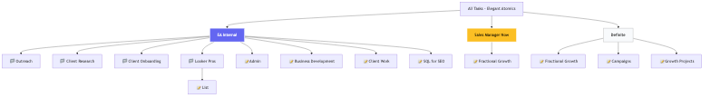
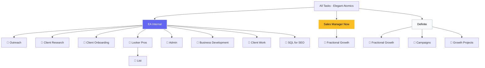
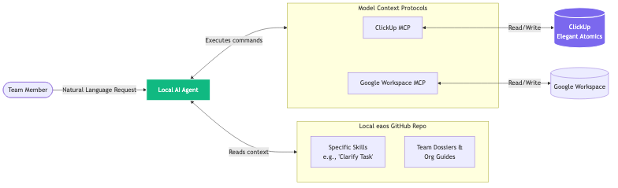
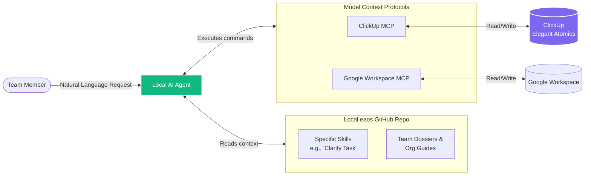

# EA OS Deliverable Outline: ClickUp Integration

**Objective:** Establish a standardized ClickUp hierarchy and integrate it with the local `eaos` GitHub repository via MCPs. This enables the AI Agent to seamlessly navigate Elegant Atomics' files and tasks, retrieve client data, and execute project management tasks using natural language.

---

### 1. ClickUp Organizational Architecture

*   **Workspace Level:** All Tasks - Elegant Atomics
*   **Space Level (1-to-1 Client Rule):** 
    *   **Internal Space (`EA Internal`):** Includes Folders (Outreach, Client Research, Client Onboarding, Looker Pros) and Lists (Admin, Business Development, Client Work, SQL for SEO).
    *   **Client Spaces:** 1 Space per Client (e.g., `Sales Manager Now`, `Definite`).
*   **Folder & List Level:** Used to categorize specific deliverables within client spaces (e.g., Fractional Growth, Campaigns, Growth Projects).

**Deliverable:** A finalized `.md` documentation file in the `eaos` repo mapping this hierarchy for AI spatial awareness.

<!--  -->

<!-- 

View Mermaid Source
 -->

<!-- 
 -->

---

### 2. ClickUp MCP Configuration

*   **Core Configuration:** Flexible, non-rigid instructions to allow robust integration while relying on "Skills" for specific context.
*   **Capabilities Setup:**
    *   *Read/Search:* Cross-space, folder, and list querying.
    *   *Write/Update:* Task creation, status updates, and commenting.
    
**Deliverable:** MCP configuration files and `.env` setup instructions pushed to the `eaos` GitHub branch.

---

### 3. EA OS Skills Library

*   **Skill 1: Environment & Tool Setup**
    *   *Purpose:* Equips the AI with exact instructions to authenticate, load variables, and initialize the ClickUp MCP server and CLI tools correctly.
*   **Skill 2: Spatial Awareness & Data Mapping**
    *   *Purpose:* Provides the AI with the exact ClickUp architecture (Spaces, Folders, Lists) so when we ask to "check the Definite campaigns," it immediately knows what List IDs to reference and read.
*   **Skill 3: Standardized Action Execution**
    *   *Purpose:* Defines how the AI should string together MCP and CLI capabilities (specifically integrating the ClickUp CLI and Google Workspace CLI) to safely modify, assign, and create tasks, or fetch Google Drive assets using natural language.

**Deliverable:** Individual Markdown/JSON skill files in the `eaos` repo. These act as the core instruction manual, allowing the team to speak to the AI normally while the skills map those requests to exact references and tool modifications.

---

### 4. Agent Interaction Workflow

<!-- 

View Mermaid Source
 -->

<!-- 
 -->

---

